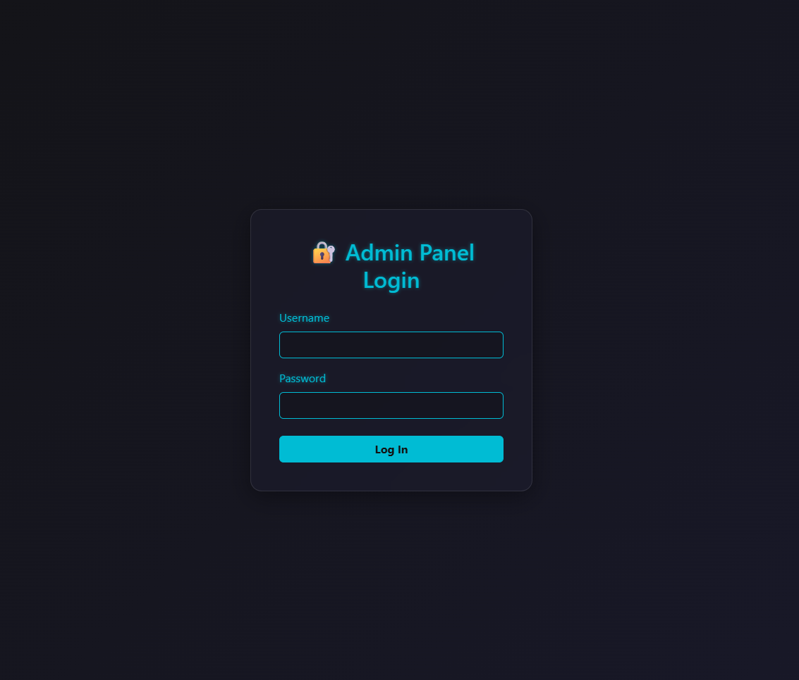
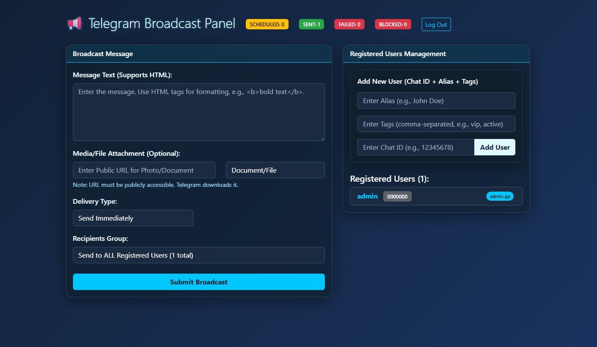

# Telegram Broadcast Panel

A powerful web-based Telegram broadcasting system with scheduling capabilities, user management, and tag-based targeting. Built with Flask and Python-telegram-bot.

## Screenshots

### Admin Login Page


### Broadcast Dashboard


## Features

### 📢 Message Broadcasting
- **Instant Broadcast**: Send messages immediately to selected users
- **Scheduled Messages**: Schedule broadcasts for future delivery with Unix timestamp support
- **Media Support**: Send photos and documents along with text messages
- **HTML Formatting**: Full HTML support for rich text formatting (bold, italic, links, etc.)

### 👥 User Management
- **User Database**: Store and manage Telegram users with chat IDs and aliases
- **Tag System**: Organize users with custom tags (e.g., "vip", "active", "subscribers")
- **Tag-based Targeting**: Send messages to specific user groups by tag
- **Flexible Recipients**: 
  - Broadcast to all users
  - Target specific tag groups
  - Manual chat ID selection

### 📊 Analytics & Logging
- **Message Status Tracking**: Monitor SENT, FAILED, and BLOCKED messages
- **Real-time Statistics**: View delivery stats on the dashboard
- **Error Logging**: Detailed error tracking for failed deliveries
- **Scheduler Status**: Monitor pending scheduled messages

### 🔒 Security
- **Admin Authentication**: Username/password protected admin panel
- **Session Management**: Secure session handling with Flask
- **Environment Variables**: Sensitive data stored in `.env` file

## Project Structure

```
TelegramBroadcastPanel/
├── app.py                 # Main Flask application & broadcast logic
├── scheduler.py           # Background scheduler for timed messages
├── requirements.txt       # Python dependencies
├── Dockerfile            # Docker container configuration
├── docker-compose.yml    # Multi-service orchestration
├── users.db              # SQLite database (auto-created)
├── templates/
│   ├── login.html        # Admin login page
│   └── broadcast.html    # Main dashboard & broadcast interface
└── .env                  # Environment variables (create this)
```

## Database Schema

### 1. telegram_users
- `id`: Auto-increment primary key
- `chat_id`: Unique Telegram chat ID
- `username`: User alias/display name
- `tags`: JSON array of tags (e.g., `["vip", "active"]`)

### 2. scheduled_messages
- `id`: Auto-increment primary key
- `message_text`: Message content
- `target_ids`: JSON array of recipient chat IDs or "all"
- `media_url`: Optional media file URL
- `media_type`: Media type (photo/document)
- `send_time`: Unix timestamp for delivery
- `status`: PENDING, SENT, or FAILED

### 3. message_logs
- `id`: Auto-increment primary key
- `chat_id`: Recipient chat ID
- `message_id`: Telegram message ID
- `send_time`: Unix timestamp of send attempt
- `status`: SENT, FAILED, or BLOCKED
- `error_details`: Error message if failed

## Installation & Setup

### Prerequisites
- Python 3.11+
- Docker & Docker Compose (for containerized deployment)
- Telegram Bot Token (from [@BotFather](https://t.me/botfather))

### Step 1: Clone Repository
```bash
git clone <repository-url>
cd TelegramBroadcastPanel
```

### Step 2: Create Environment File
Create a `.env` file in the root directory:

```env
TELEGRAM_BOT_TOKEN=your_bot_token_here
ADMIN_USERNAME=admin
ADMIN_PASSWORD=your_secure_password
```

**Important**: Replace the placeholder values with your actual credentials.

### Step 3: Choose Deployment Method

#### Option A: Docker Compose (Recommended)

```bash
# Build and start all services
docker-compose up -d

# View logs
docker-compose logs -f

# Stop services
docker-compose down
```

This starts two containers:
- **web**: Flask app with Gunicorn (port 5000)
- **scheduler**: Background service for scheduled messages

#### Option B: Manual Installation

```bash
# Install dependencies
pip install -r requirements.txt

# Initialize database and start Flask app
python app.py

# In a separate terminal, start the scheduler
python scheduler.py
```

### Step 4: Access the Panel
Open your browser and navigate to:
```
http://localhost:5000
```

Login with the credentials from your `.env` file.

## Usage Guide

### Adding Users
1. Navigate to the "Registered Users Management" section
2. Enter user details:
   - **Alias**: Display name (e.g., "John Doe")
   - **Tags**: Comma-separated tags (e.g., "vip, active")
   - **Chat ID**: Telegram chat ID (numeric)
3. Click "Add User"

**Getting Chat IDs**: Users must first message your bot. You can retrieve their chat IDs using:
```python
from telegram import Update
# In your bot handler
update.effective_chat.id
```

### Sending Messages

#### Immediate Broadcast
1. Enter message text (HTML supported: `<b>bold</b>`, `<i>italic</i>`, `<a href="url">link</a>`)
2. (Optional) Add media URL and select type
3. Select "Send Immediately"
4. Choose recipient group:
   - **ALL**: All registered users
   - **Group: [tag]**: Users with specific tag
   - **Manual IDs**: Enter chat IDs manually
5. Click "Submit Broadcast"

#### Scheduled Broadcast
1. Enter message content and recipients (same as above)
2. Select "Schedule for Later"
3. Pick date and time using the datetime picker
4. Click "Submit Broadcast"

The scheduler service will automatically send the message at the specified time.

### Media Attachments
- **Photo**: Provide a public URL to an image (JPEG, PNG, etc.)
- **Document**: Provide a public URL to any file (PDF, ZIP, etc.)
- Telegram will download and cache the media from the URL

**Note**: URLs must be publicly accessible (no authentication required).

## Technical Details

### Architecture
- **Flask**: Web framework for the admin panel
- **SQLite**: Lightweight database for users and logs
- **python-telegram-bot**: Async Telegram Bot API wrapper
- **Gunicorn**: Production WSGI server
- **Docker**: Containerization for easy deployment

### Scheduler Behavior
- Runs every 60 seconds (`SCHEDULER_SLEEP_TIME`)
- Checks for pending messages where `send_time <= current_time`
- Attempts delivery to all target recipients
- Updates status to SENT or FAILED
- Logs all delivery attempts with error details

### Error Handling
- **TelegramError**: Catches bot-related errors (blocked users, invalid chat IDs)
- **BLOCKED Status**: Automatically detected when users block the bot
- **Retry Logic**: Failed messages remain in logs for review (no auto-retry)

### Session Security
- Session secret key generated with `os.urandom(24)`
- Login required for all routes except `/login`
- Automatic redirect to login for unauthenticated requests

## API Endpoints

| Endpoint | Method | Description |
|----------|--------|-------------|
| `/login` | GET/POST | Admin authentication |
| `/logout` | GET | End session |
| `/` | GET/POST | Main dashboard (broadcast & user management) |

## Environment Variables

| Variable | Description | Required |
|----------|-------------|----------|
| `TELEGRAM_BOT_TOKEN` | Bot token from @BotFather | Yes |
| `ADMIN_USERNAME` | Admin panel username | Yes |
| `ADMIN_PASSWORD` | Admin panel password | Yes |

## Troubleshooting

### Database Not Found
The database is auto-created on first run. If missing:
```bash
python -c "from app import init_db; init_db()"
```

### Scheduler Not Running
Check docker logs:
```bash
docker-compose logs scheduler
```

Ensure the scheduler container is running:
```bash
docker-compose ps
```

### Messages Not Sending
1. Verify bot token is correct
2. Ensure users have started your bot (sent `/start`)
3. Check chat IDs are valid (numeric)
4. Review message logs in the dashboard

### Port Already in Use
Change the port in `docker-compose.yml`:
```yaml
ports:
  - "8080:5000"  # Use port 8080 instead
```

## Deployment Tips

### Production Settings
- Use strong, unique passwords
- Enable HTTPS with a reverse proxy (nginx, Caddy)
- Set `debug=False` in `app.py` for production
- Use environment-specific `.env` files
- Regular database backups of `users.db`

### Scaling
- For high-volume broadcasting, consider:
  - Redis for session management
  - PostgreSQL instead of SQLite
  - Celery for distributed task queue
  - Rate limiting to avoid Telegram API limits

### Telegram API Limits
- Maximum 30 messages/second to different users
- Maximum 20 messages/minute to the same user
- Consider implementing delays for large broadcasts

## License
MIT License - Feel free to modify and distribute.

## Contributing
Pull requests are welcome! Please open an issue first to discuss proposed changes.

## Support
For issues and questions, please open a GitHub issue.